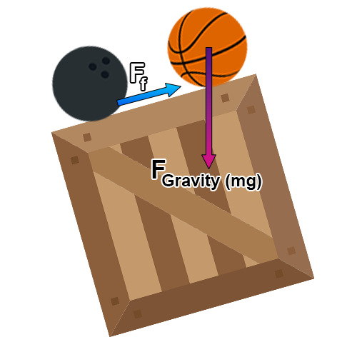

# Impat Engine

Impat Engine is a 2D Game Physics Engine written in C++ that provides robust physics simulation including rigid body dynamics, collision detection/resolution, and more. It’s designed with inspiration from popular physics libraries such as [Box2D](https://box2d.org/) and [Chipmunk2D](https://chipmunk-physics.net/).

### 🌐 [Impact Engine - Official Website](https://impact.mattmaster.com)

[](https://impact.mattmaster.com)


---

## Table of Contents

- [Features](#features)
- [Requirements](#requirements)
- [Installation & Build Instructions](#installation--build-instructions)
  - [Windows](#windows)
  - [Linux](#linux)
  - [macOS](#macos)
- [Usage](#usage)
- [Documentation](#documentation)
- [Contributing](#contributing)
- [License](#license)
- [Acknowledgements](#acknowledgements)

---

## Features

- **Rigid Body Dynamics:** Simulate objects with linear and angular motion.
- **Collision Detection & Resolution:** Supports circles, boxes, and polygon shapes.
- **Force & Impulse Handling:** Includes weight, friction, drag, spring, and gravitational forces.
- **SDL2 Integration:** Utilizes SDL2 (with SDL2_image and SDL2_gfx) for rendering and texture handling.
- **Modular & Extensible:** Designed to be easily integrated into your own projects or extended with new features.

---

## Requirements

- **C++ Compiler:** Visual C++ (Windows) or GCC (Linux/macOS)
- **SDL2 Libraries:** SDL2, SDL2_image, and SDL2_gfx
- **Build Tools:** Visual Studio 2022 (Windows) or make/GCC (Linux/macOS)

---

## Installation & Build Instructions

### Windows

1. **Visual Studio 2022:**

   - Download and install [Visual Studio 2022](https://visualstudio.microsoft.com/vs/). During installation, ensure you select the **Desktop Development with C++** workload so that the Visual C++ compiler is installed.

2. **Project Setup:**

   - You have two options:
     - **Option 1:** Download the complete Visual Studio project as provided.
     - **Option 2:** Create your own Visual Studio project and copy the `src`, `assets`, and `lib` folders into your project directory. Then add these folders to your project via the Visual Studio Solution Explorer.

3. **SDL2 & SDL2_image:**

   - Download the development libraries for Visual C++ from:
     - [SDL2 Download](https://github.com/libsdl-org/SDL/releases)
     - [SDL2_image Download](https://github.com/libsdl-org/SDL_image/releases)
   - Make sure to install the latest 2.x.x versions of both libraries and not 3.x.x.
   - Extract SDL2 to a global folder (e.g., `C:\SDL2`).
   - Extract SDL2_image and copy its contents into the same SDL2 folder, merging with the existing files. This ensures that both libraries reside under the `include` and `lib` directories.

4. **Linking SDL Libraries to the Project:**
   - Right-click on your project name in the **Solution Explorer** and choose **Properties**.
   - **Configuration:** Select the desired configuration (recommended: Debug Win32 to support 32-bit machines).
   - **VC++ Directories:**
     - **Include Directories:** Add `C:\SDL2\include`
     - **Library Directories:** Add `C:\SDL2\lib\x86` (using x86 ensures compatibility with 32-bit systems)
   - **Linker Settings:**
     - Go to **Linker → Input → Additional Dependencies** and add:
       - `SDL2.lib`
       - `SDL2main.lib`
       - `SDL2_image.lib`
   - **DLL Files:**
     - Copy the DLLs (`SDL2.dll` and `SDL2_image.dll`) from `C:\SDL2\lib\x86` (or x64, if applicable) into the same directory as your `.vcxproj` file.

---

### Linux

1. **Install Dependencies:**

   Open your terminal and run:

   ```bash
   sudo apt update
   sudo apt install build-essential
   sudo apt install libsdl2-dev
   sudo apt install libsdl2-image-dev
   sudo apt install libsdl2-gfx-dev
   ```

2. **Compile and Run:**

   Use the provided Makefile (or create one) to compile:

   ```bash
   make build
   make run
   ```

   Clean up with:

   ```bash
   make clean
   ```

---

### macOS

1. **Install Dependencies with Homebrew:**

   Open Terminal and run:

   ```bash
   brew update
   brew install sdl2
   brew install sdl2_image
   brew install sdl2_gfx
   ```

2. **Compile and Run:**

   Use the provided Makefile to build and run the engine:

   ```bash
   make build
   make run
   ```

   Clean up with:

   ```bash
   make clean
   ```

---

## Usage

Once built, the engine can be integrated into your game projects. The main executable launches a simulation where:

- **Left Mouse Button:** Creates a dynamic circular body (with a basketball texture).
- **Right Mouse Button:** Creates a box-shaped dynamic body (with a crate texture).
- **Middle Mouse Button:** Creates a bowling-ball-like dynamic body.

These bodies interact with static objects (such as walls and a floor) and with each other under simulated physics forces including gravity, friction, and applied impulses.

For more detailed usage examples, please refer to the sample code in the `src` directory.

---

## Documentation

Comprehensive documentation, including API references and examples, is available on the official Impact Engine documentation website:  
[https://impact-docs.vercel.app/](https://impact-docs.vercel.app/)

---

## Contributing

Contributions to the Impat Engine are welcome! If you’d like to report issues, suggest features, or submit pull requests, please follow our contribution guidelines:

1. Fork the repository.
2. Create a feature branch.
3. Commit your changes.
4. Submit a pull request for review.

---

## License

This project is licensed under the MIT License. See the [LICENSE](LICENSE) file for details.

---

## Acknowledgements

- Special thanks to the teams behind [Box2D](https://box2d.org/) and [Chipmunk2D](https://chipmunk-physics.net/) for their invaluable contributions to the field of physics simulation.
- Thanks to the SDL community for providing an excellent multimedia library.
